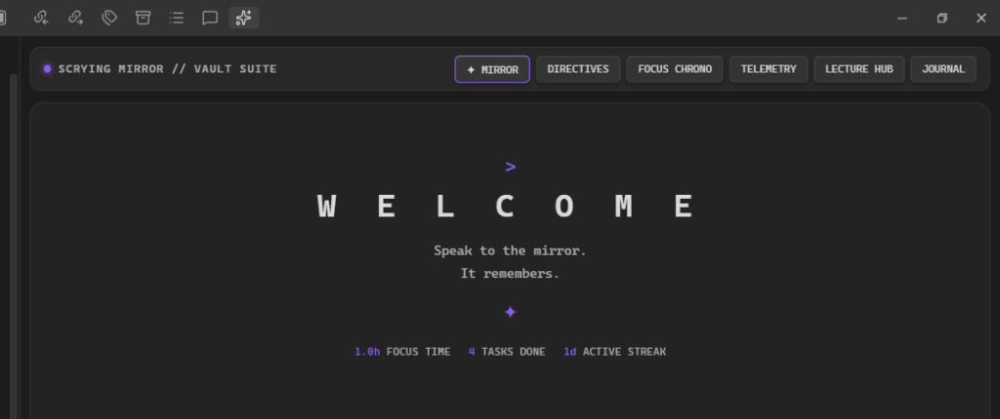
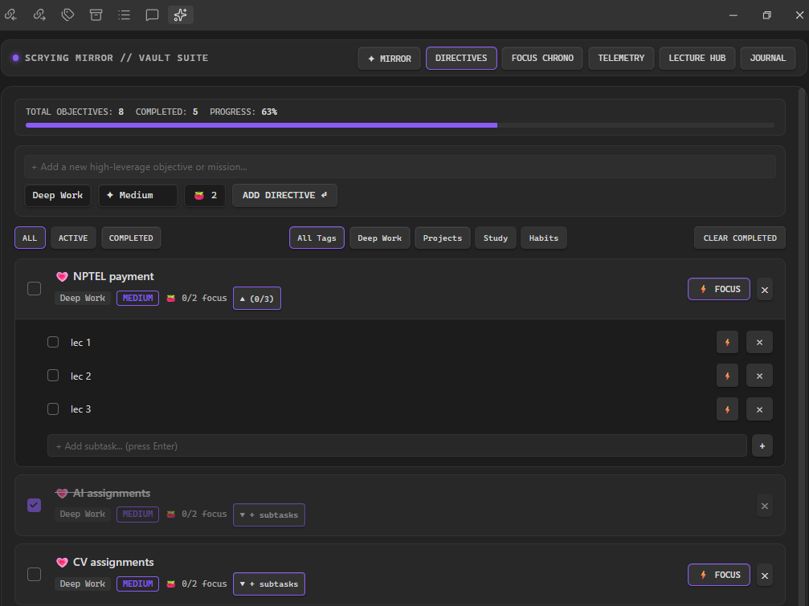
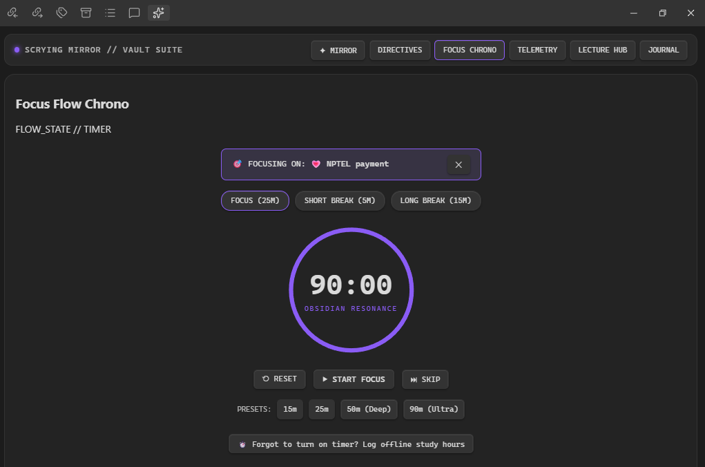
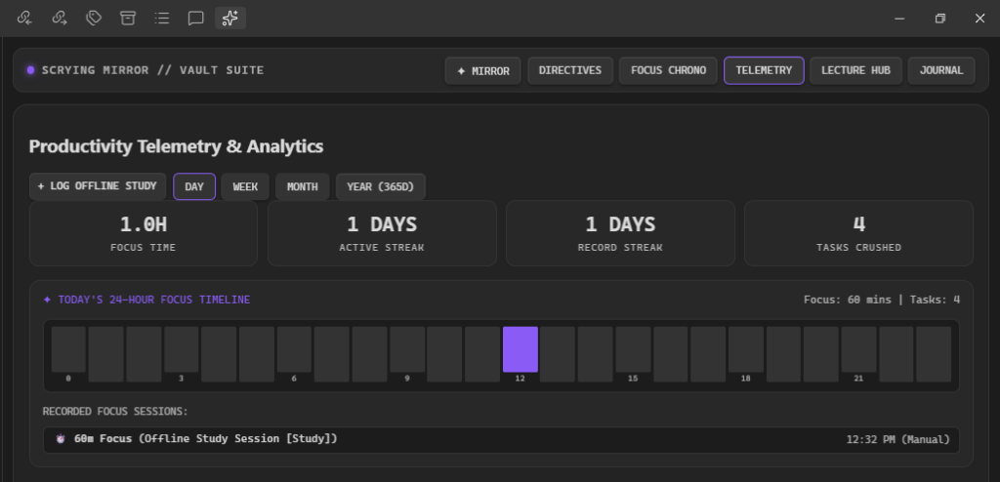
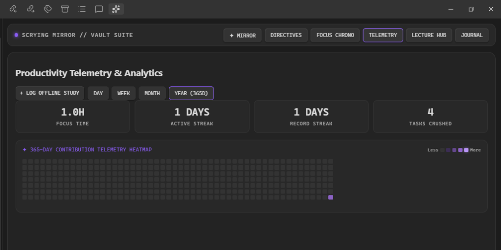

# ✧ Scrying Mirror of Productivity ✧

### *Speak to the mirror. It remembers.* ✦

An all-in-one productivity suite, focus sanctuary, and luxury workspace native to **Obsidian**:  
**Flow-State Pomodoro Chrono** • **Directives Matrix with Unlimited Subtasks** • **Multi-Timescale Telemetry & 365-Day Heatmap** • **Offline Study Logger** • **Lecture Theater** • **Liquid Writings Studio with Inline Images & Vault Sync**.

 

---

## 📸 Visual Showcase & Previews

### 1. ✦ Directives & Unlimited Nested Subtasks
> Break high-leverage missions into infinite micro-steps with collapsible drawers, live progress tracking, and 2-way indented Markdown sync (`ScryingMirror/Tasks.md`).

  

---

### 2. ⚡ Focus Flow Chrono (Pomodoro)
> Seamless SVG dial countdown timer with Obsidian resonance glow. Connect any directive or individual subtask directly to the timer using the **`⚡ FOCUS`** button.

  

---

### 3. 📊 Multi-Timescale Telemetry & Analytics

  <table>
    <tr>
      <td width="50%">
        
<strong>Today's 24-Hour Timeline & Offline Session Logger</strong>

        
      </td>
      <td width="50%">
        
<strong>365-Day Contribution Telemetry Heatmap</strong>

        
      </td>
    </tr>
  </table>

---

## ✨ Core Features

| Feature | Description | Vault Sync Target |
| :--- | :--- | :--- |
| **✦ Directives Matrix** | Priority tags (`CRITICAL`, `HIGH`, `MEDIUM`), Tomato goals (`🍅`), and unlimited nested micro-checklists. | `ScryingMirror/Tasks.md` |
| **⚡ Focus Flow Chrono** | 25m focus, 5m short break, 15m long break, 50m deep work & 90m ultra flow states. | Real-time Telemetry |
| **⏱️ Offline Study Logger** | Log past/untracked study hours, categories, and topics directly into streaks and heatmap. | Telemetry History |
| **📊 Multi-Timescale Charts** | 24-Hour Timeline, 7-Day Velocity Bars, Monthly Calendar, and 365-Day Heatmap. | `ScryingMirror/Telemetry.json` |
| **🎥 Lecture Theater** | Split-screen YouTube player + real-time timestamped scratchpad. | `ScryingMirror/Lectures/` |
| **🖋️ Liquid Writings Studio** | Rich reflection journal supporting unlimited inline images (`Ctrl+V` paste, drag & drop, file picker). | `ScryingMirror/Journal/` |
| **🎨 Native Theme Resonance** | Adapts dynamically to any Obsidian Light or Dark theme using native CSS variables. | Fully Local & Offline |

---

## 📦 Installation

### Official Obsidian Community Plugins
1. In Obsidian, open **Settings** ➔ **Community plugins**.
2. Turn **Restricted mode** to **OFF**.
3. Click **Browse** and search for **`Scrying Mirror of Productivity`**.
4. Click **Install**, then **Enable**.

### Manual Installation
1. Download `main.js`, `manifest.json`, and `styles.css` from the [Latest Release](https://github.com/Lyra-4leafclover/Scrying-Mirror-of-Productivity-plugin-Obsidian-Plugin/releases).
2. Create a folder in your vault: `.obsidian/plugins/obsidian-scrying-mirror/`.
3. Copy all 3 files into that folder.
4. In Obsidian, go to **Settings** ➔ **Community plugins** ➔ toggle **Scrying Mirror of Productivity** to **ON**.

---

## 🛠️ Open Source & Contributing

Contributions, feature requests, and bug reports are welcome!  
Feel free to open an issue or submit a pull request on the [GitHub repository](https://github.com/Lyra-4leafclover/Scrying-Mirror-of-Productivity-plugin-Obsidian-Plugin).

---

## 📄 License

This plugin is open source and licensed under the [MIT License](LICENSE).  
Developed with 💜 by [Lyra](https://github.com/Lyra-4leafclover).
